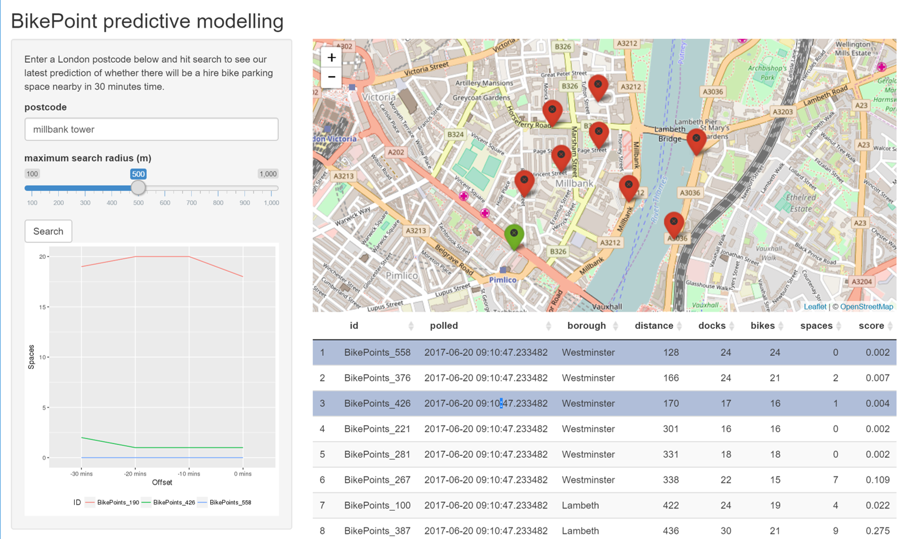
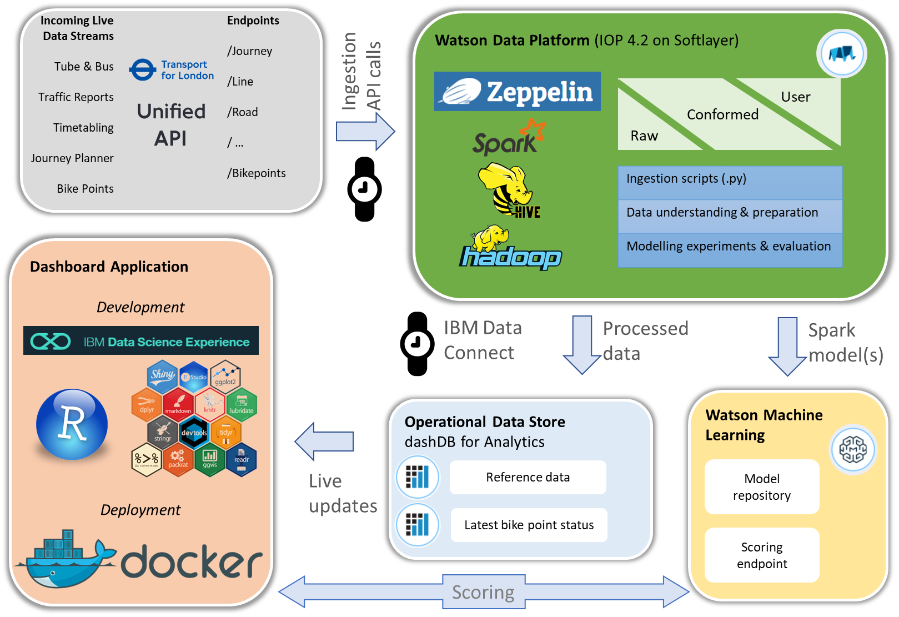

# Overview

The __[bikepoint prediction demo](https://ibm.biz/BdjRJd)__ was created for an IBM internal public sector event. It was intended to communicate the capabilities of the __[Watson Data Platform](https://www.ibm.com/analytics/us/en/watson-data-platform/)__: a Hadoop and Spark cluster environment with additional ingestion and curation assets developed by IBM Global Business Services.

# The problem

Getting around London can be awkward at the best of times, but nothing is more irritating than renting a Boris Bike[1](#f1)
, completing your journey to a client's office and finding no available spaces in the nearby docking stations.

Others have attempted to overcome this problem by taking the frequently updated data made available through the [Transport for London Unified API](https://api.tfl.gov.uk/) (which details for every _bikepoint_: location, number of bikes, docks and spaces) and publishing it to e.g. [a smartphone app](https://play.google.com/store/apps/details?id=uk.gov.tfl.cyclehire&hl=en_GB), where users can see ahead of time which docks will have spaces.

The intent of this demo was to go a step further and employ historic usage data and current availability to predict the likelihood of a docking station having a space. In doing so, it can assist users in selecting a suitable dock to head for and budgeting extra travel time if required.

# Details of the solution

## Overview

#### High level system architecture

## User interface

The user interface for the demo was created in __[Shiny](https://shiny.rstudio.com/)__, a library for creating interactive dashboards in __R__. It uses:

- __[leaflet](http://leafletjs.com/)__ for the mapping tasks;
- __[ggmap](https://github.com/dkahle/ggmap)__ for geolocation of postcodes; and
- __[ggplot2](http://ggplot2.org/)__ to produce the dynamic line charts.

The dashboard is running in its own application server, __[ShinyServer](https://www.rstudio.com/products/shiny/shiny-server/)__, within a __[Kubernetes](https://kubernetes.io/)__ "pod" hosted within the IBM Bluemix Platform-as-a-Service.

A _Shiny_ event listener waits for the user to press `Search`, starting the following chain of events:

1. Geolocation of the postcode (or landmark) entered by the user (using the Google Maps API);
2. Translation of lat / lon returned by the service into northing and easting;
3. Distance between each _bikepoint_ and the destination calculated and _bikepoints_ filtered according to the value of the slider;
4. Latest availability data for in-scope _bikepoints_ sent to __[Watson Machine Learning](https://console.bluemix.net/catalog/services/machine-learning)__ scoring endpoint via HTTP request; probabilities returned; and finally
5. Results sent to data table and used to plot and shade markers on map.

## Scoring

Scoring is provided by the __[Watson Machine Learning](https://console.bluemix.net/catalog/services/machine-learning)__ service.

__WML__ permits an analyst to upload __[Spark ML](https://spark.apache.org/docs/latest/ml-guide.html)__ or __[SciKit Learn](http://scikit-learn.org/stable/)__ models (or SPSS Modeler scoring streams) into a repository and then deploy them for online scoring through a RESTful API. The service also has a capability for performing batch scoring runs, though it was not considered for this application.

Spark models submitted to this service must be created in Spark 2.0. Given the cluster provisioned by Bluemix was at version 1.6, this meant the models themselves had to be built outside the cluster, in this case in the [__IBM Data Science Experience__](http://datascience.ibm.com) which boasts a direct integration with __WML__ to allow you to test deployed models from within the __DSX__ environment.

## Feature engineering, selection and model creation and evaluation

As this was just for demonstration purposes, I created a baseline model from a simple set of predictor variables, including:

1) Current number of docking station spaces at time of observation;
2) Docking station spaces: lag 10, 20 and 30 minutes;
3) Distance as the crow flies from Charing Cross station;
4) AM or PM peak time;
5) Weekday or weekend.

- No feature selection was performed prior to entering variables into models, making this a clear target for any future work.
- The model created was a simple logistic regression, with the target being a 1/0 flag to indicate whether spaces were available in the current observation.
- Model performance was assessed using the area under the ROC curve metric, measured across both the training and test datasets in a "holdout" arrangement.
- The model was not tuned after its first iteration nor were any further diagnostics performed on the model or its inputs.

## ETL and ingestion

The output of the __[_Bikepoint_ API](https://api.tfl.gov.uk/swagger/ui/index.html?url=/swagger/docs/v1#!/BikePoint/BikePoint_GetAll)__ is downloaded at ten minute intervals, parsed and stored in comma separated text format on the cluster's HDFS file system. It is then made available for analysis as an external Hive table.

At five minute intervals, an __[IBM Data Connect](https://console.bluemix.net/catalog/services/data-connect)__ job copies the latest data to a __[dashDB](https://console.bluemix.net/catalog/services/dashdb)__ cloud data warehouse, overwriting the data that was stored there previously. Both services are hosted within Bluemix.

These intervals could comfortably be shortened, especially if more compute capacity was made available within the cluster.

# Assets in the repository

- `app/`

    Contains the dashboard code in the file _app.R_.

- `cluster-code/`

    Contains the code (Zeppelin notes) run on the cluster:

    File|Purpose
    -|-
    bikepoint-ingest.json|Ingest and transform data
    bikepoint-data-exp.json|Explore the data Build the predictive model
    deploy-model.ipynb|Model deployment through WML
    bikepoint-hive-ddl.json|Create the Hive tables to support analytics

- `Dockerfile`

    Container recipe for building dashboard [Docker](https://www.docker.com/) image.

- `bikepoint-demo-service.yml`

    Pod and service definitions for Kubernetes.

# Not present in this repository

- Helper assets to install Zeppelin on a Bluemix BigInsights cluster running IOP 4.2 (can be found [here](https://github.com/IBM-Bluemix/BigInsights-on-Apache-Hadoop)).
- Data connect jobs to create the bikepoint reference data in dashDB and repopulate the operational data store.

<a id="f1">1</a>: A colloquial term for our city's public hire bicycles, named after the former Mayor of London, Boris Johnson.